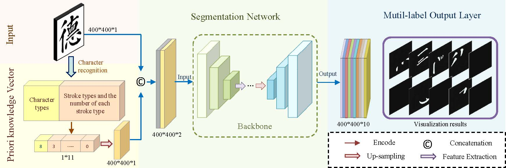

# Stroke-Seg: A Deep Learning-based Framework for Chinese Stroke Segmentation 🖌️

[](https://ietresearch.onlinelibrary.wiley.com/journal/17519667)
[](https://GitHub.com/Rvosuke/Stroke-Seg/stargazers/)
[](https://opensource.org/licenses/MIT)

## 📝 About

Stroke-Seg is a novel framework designed to improve the stroke segmentation of Chinese characters by tackling complex stroke characteristics. This repository contains the implementation of our method, which is currently published at IET Image Processing.



## 🔑 Key Features

- 🧠 Incorporates a Prior Knowledge Vector for enhanced character understanding
- 🏷️ Multi-label output strategy for handling intersecting strokes
- 💪 Compatible with various network architectures (CNNs and Transformers)
- 📊 Dedicated 'Stroke Class' mechanism for balancing stroke distribution
- 🎯 Novel BDLoss strategy for capturing both global and local stroke features

## 📊 Results

The dataset used in this project, BCSS (Brush Calligraphy Stroke Segmentation), is available in a separate repository: [Rvosuke/BCSS](https://github.com/Rvosuke/BCSS)

Our framework demonstrates excellent generalization ability and compatibility with various architectures. Compared to existing methods, Stroke-Seg achieves remarkable improvements in True Stroke Rate while requiring less computational cost.

## 📖 Citation

If you find our work useful in your research, please consider citing:

```bibtex
@article{gong2024strokeseg,
author = {Gong, Xinyu and Bai, Zeyang and Nie, Haitao and Xie, Bin},
title = {Stroke-Seg: A deep learning-based framework for chinese stroke segmentation},
journal = {IET Image Processing},
doi = {https://doi.org/10.1049/ipr2.13255},
}
```
